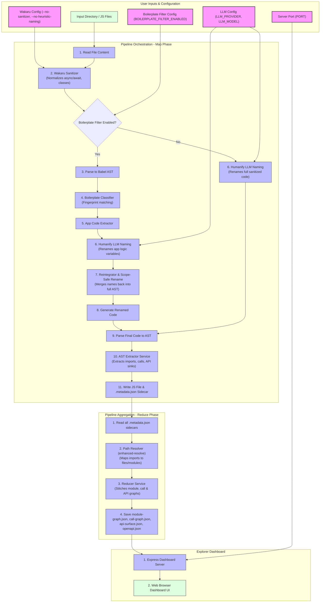

# JS Cartographer - Architecture & Design Reference

This document outlines the internal design, component specifications, data contracts, and error-isolation guides of JS Cartographer. Use this guide to understand how input files are processed and to isolate pipeline failures.

---

## 1. High-Level Architecture

JS Cartographer is built around an in-memory **Map-Reduce Pipeline** designed for high-performance Abstract Syntax Tree (AST) recovery and semantic analysis.

```
                  ┌──────────────────────────────────────────┐
                  │           Input JS File Directory        │
                  └────────────────────┬─────────────────────┘
                                       │
                                       ▼
  ┌────────────────────────────────────────────────────────────────────────┐
  │                            MAP PHASE (Local)                           │
  │  For each file:                                                        │
  │  Sanitize (Wakaru) ──► Filter (AST) ──► Deobfuscate (LLM) ──► Extract  │
  └────────────────────────────────────┬───────────────────────────────────┘
                                       │
                                       ▼
                  ┌──────────────────────────────────────────┐
                  │       Cleaned JS + .metadata.json        │
                  └────────────────────┬─────────────────────┘
                                       │
                                       ▼
  ┌────────────────────────────────────────────────────────────────────────┐
  │                          REDUCE PHASE (Global)                         │
  │  Stitch calls/imports ──► Path Resolution ──► Global Graph & OpenAPI   │
  └────────────────────────────────────┬───────────────────────────────────┘
                                       │
                                       ▼
                  ┌──────────────────────────────────────────┐
                  │      Interactive Dashboard UI Server     │
                  └──────────────────────────────────────────┘
```

- **Map Phase (Local File Processing)**: Processes individual files isolated from each other. Each file undergoes structural sanitization (Wakaru), boilerplate/polyfill filtering, identifier renaming (LLM), and metadata extraction (local imports, call graphs, API endpoints). The resulting code and a `.metadata.json` sidecar are written to the output directory.
- **Reduce Phase (Global Aggregation)**: Resolves relative and absolute imports across all modules using `enhanced-resolve`. It aggregates local call graphs, module dependencies, and API endpoints into global representations (`module-graph.json`, `call-graph.json`, `api-surface.json`, and `openapi.json`).

---

## 2. Global CodeFlow & Configuration Diagram

The diagram below details the path of raw code as it is parsed and processed. The user-configurable variables and CLI option hooks are highlighted.



---

## 3. Component Deep-Dive

### A. Wakaru Sanitizer (`WakaruSanitizer`)
The sanitizer executes pre-processing unminify steps:
- **Structural Normalization**: Unrolls sequence expressions (`a = 1, b = 2` into separate statements), normalizes yoda comparisons, restores templates, and expands variables merged by bundlers.
- **Syntactic Sugar Recovery**: Rebuilds transpiled class definitions (`class` helper calls to ES6 class blocks) and async/await generators back to native syntax.
- **Fail-safe Design**: If unminifying fails, the original raw file contents are passed through to the next stage rather than halting the process.

### B. AST Parser & centralized Babel Interop (`BabelASTService`)
Resolves module interop and CommonJS/ESM issues with Babel:
- Safely references default exports from `@babel/core`, `@babel/traverse`, and `@babel/generator`.
- Parses JavaScript source code using typescript and JSX parser plugins.
- Generates clean, properly indented JavaScript from revised ASTs.

### C. Boilerplate / Polyfill Filter (`BoilerplateClassifier` & `AppCodeExtractor`)
Filters out common, non-application helper libraries to reduce LLM token usage:
- **Unwrapping Outer IIFE wrappers**: Identifies if the target is a Webpack/Rollup bundle wrapped inside an IIFE (e.g. `!function(){...}()`). It extracts the internal block statements to classify them individually.
- **Fingerprint Matching**: Compares statement AST nodes against structural and string heuristics. Large frameworks (like Babel generator runtimes) and helpers (like `_typeof`, `_classCallCheck`, `_createClass`, `_defineProperty`) are marked as `'boilerplate'`.
- **Extractor**: Gathers all `'app'` classified nodes and generates `appCode` which is approximately **60-80% smaller** than the fully unminified code.
- **Reintegrator**: Constructs a `RenameMap` by parallel-diffing the original AST and renamed AST. It applies scope-safe identifier renames across the **entire** AST (automatically updating cross-references in the boilerplate nodes).

### D. Humanify Service (`HumanifyService`)
Executes identifier humanization:
- **CLI Runner**: Spawns the Rust `humanify` binary using `child_process.spawn`.
- **Agy Proxy (Ollama)**: Emulates an Ollama REST server inside Node.js to capture humanify ollama API queries and route them directly to the `agy` CLI command.
- **Token Rate-limiting**: Schedules requests using an in-memory token-refill bucket to prevent overloading the local LLM CLI processes or API endpoints.

### E. AST Extractor Service (`ASTExtractorService`)
Collects semantic metadata from the finalized AST:
- **Imports/Exports**: Scrapes imports/requires and ES modules exports.
- **Call Relationships**: Builds call hierarchies, tracking references and target endpoints.
- **API Sinks**: Identifies fetch patterns, Axios requests, and endpoints.

### F. Reducer Service (`ReducerService`)
Merges file metadata into a global project structure:
- **enhanced-resolve**: Leverages Webpack's resolver to trace imported modules to their actual file targets.
- **Graph Assembly**: Merges individual call graphs, calculates caller/callee paths, and generates the module dependency flow.
- **OpenAPI Complier**: Normalizes API sinks and exports a structured `openapi.json` contract.

---

## 4. Data Specifications & Contracts

### A. Local Metadata Sidecar (`.metadata.json`)
Generated for each source file:
```json
{
  "id": "src/utils.js",
  "imports": ["./config.js"],
  "exports": ["formatText", "sanitizeInput"],
  "definedFunctions": [
    { "name": "formatText", "line": 5 },
    { "name": "sanitizeInput", "line": 12 }
  ],
  "calls": [
    { "from": "formatText", "to": "sanitizeInput", "type": "internal", "line": 7 }
  ],
  "apiSinks": []
}
```

### B. Global Graph Contracts
Aggregated in the output directory:
- **`module-graph.json`**:
  ```json
  {
    "modules": {
      "src/utils.js": {
        "dependencies": ["src/config.js"],
        "exports": ["formatText", "sanitizeInput"]
      }
    }
  }
  ```
- **`call-graph.json`**:
  ```json
  {
    "nodes": {
      "src/utils.js:formatText": { "name": "formatText", "file": "src/utils.js" }
    },
    "edges": [
      { "from": "src/utils.js:formatText", "to": "src/utils.js:sanitizeInput" }
    ]
  }
  ```
- **`api-surface.json`**:
  ```json
  {
    "endpoints": [
      {
        "file": "src/api.js",
        "method": "POST",
        "urlPattern": "/api/v1/users",
        "callerFunction": "createUser"
      }
    ]
  }
  ```

---

## 5. Troubleshooting & Error Isolation Matrix

Use the matrix below to isolate issues.

| Symptom / Error | Processing Stage | Probable Component Culprit | Debug / Isolation Steps |
|:---|:---|:---|:---|
| **`SyntaxError: ...`** during Wakaru or AST parsing | Map Phase: Sanitization / Parse | `WakaruSanitizer` or `BabelASTService` | 1. Run `node dist/cli/run.js plan <file>` with and without `--no-sanitizer` to see if parsing succeeds.<br/>2. Inspect the file to check for ESNext syntax features that require additional Babel plugins. |
| **`API Rate Limit Exceeded`** or execution hangs | Map Phase: Rename | `HumanifyService` (Token Refiller) | 1. Ensure `BOILERPLATE_FILTER_ENABLED=true` to decrease prompt payload sizes.<br/>2. If using cloud APIs, check rate limits or throttle thread concurrency. |
| Missing user functions or variables are not renamed | Map Phase: Filter / Rename | `BoilerplateClassifier` / `AppCodeExtractor` | 1. Check if the function contains signature string patterns matching a boilerplate fingerprint.<br/>2. Adjust `isShortFunction` statement threshold if the app function is small. |
| **`Module not found`** or `Unresolved import` in reducer | Reduce Phase: Aggregation | `ReducerService` (enhanced-resolve) | 1. Check path configuration aliases in the bundle's bundler config (e.g. Webpack aliases).<br/>2. Inspect target file dependencies in `.metadata.json` to verify relative resolution paths. |
| Visualizer graphs are empty | Reduce Phase: Global Stitching | `ReducerService` | 1. Ensure that sidecar `.metadata.json` files exist alongside generated `.js` files.<br/>2. Verify that there is at least one function definition or import link connecting files. |
| **`Express EADDRINUSE: port already in use`** | Dashboard Phase | CLI Runner / Dashboard | 1. Check if another instance of JS Cartographer dashboard is running.<br/>2. Override the default port using `PORT=xxxx` or the `-p` CLI parameter. |
