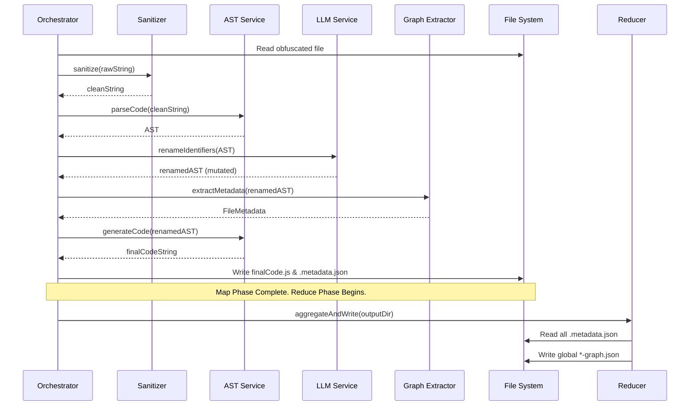

# JS Cartographer (v3 Greenfield): Technical Specification

This specification details the technical interfaces, data structures, and module contracts for the JS Cartographer v3 Map-Reduce pipeline, aligning with the architectural goals defined in `PRD.md` and `IMPLEMENTATION.md`.

---

## 1. Core Architecture & Constraints

* **Runtime:** Node.js (v18+)
* **Module System:** ECMAScript Modules (ESM). The `package.json` must specify `"type": "module"`.
* **TypeScript:** Configured with `"moduleResolution": "NodeNext"` and `"module": "NodeNext"` to ensure strict ESM compatibility.

---

## 2. Core Data Structures

### 2.1 Local File Metadata (`.metadata.json`)
Generated per-file during the "Map" phase to ensure fault-tolerance.
```typescript
interface FileMetadata {
  id: string; // Relative path, e.g., "src/auth.js"
  imports: string[]; // Raw import strings: ["./utils", "react"]
  exports: string[]; // Exported symbol names: ["loginUser", "Token"]
  definedFunctions: {
    id: string; // e.g., "src/auth.js:loginUser"
    name: string;
    line: number;
  }[];
  calls: {
    from: string; // Caller ID
    to: string; // Callee Name (unresolved)
    type: "internal" | "external";
  }[];
  apiSinks: {
    method: string;
    urlPattern: string; // e.g., "/api/users/${id}"
  }[];
}
```

### 2.2 Global Output Artifacts (The "Reduce" Phase)
Generated by stitching the metadata sidecars together.
* `module-graph.json`: Maps canonical files to their dependencies.
* `call-graph.json`: Directed edges connecting specific function nodes across the entire project.
* `api-surface.json`: Aggregated list of all network boundaries (REST endpoints).

---

## 3. Service Contracts

### 3.1 Centralized AST Service (`src/services/ast/babel-core.ts`)
**Purpose:** Eliminate CJS/ESM interop crashes and centralize Babel parser configurations (TypeScript + JSX plugins).
```typescript
export interface ASTService {
  parseCode(code: string): babel.types.File;
  traverseAst(ast: babel.types.File, visitors: babel.TraverseOptions): void;
  generateCode(ast: babel.types.File): string;
  renameBinding(scope: babel.Scope, oldName: string, newName: string): void;
}
```

### 3.2 Syntactic Sanitizer (`src/services/sanitizer/wakaru-service.ts`)
**Purpose:** Pre-process transpiled artifacts. Wakaru acts as a boundary because it consumes and returns strings, not ASTs.
```typescript
export interface SanitizerService {
  /**
   * Applies deterministic rules (e.g. un-async-await, un-jsx).
   * Runs BEFORE Babel parsing.
   */
  sanitize(rawCode: string, filepath: string): Promise<string>;
}
```

### 3.3 LLM Renaming Service (`src/services/llm/rename-service.ts`)
**Purpose:** Query Cloud LLMs (Gemini/OpenAI) using structured JSON output schemas to apply semantic names to obfuscated variables.
```typescript
export interface RenameService {
  /**
   * Modifies the AST in place. Returns token/cost metrics.
   */
  renameIdentifiers(ast: babel.types.File): Promise<RenameMetrics>;
}
```
* **Heuristic Filter:** Must internally skip identifiers matching `/^window|document|Array|Promise$/` or lengths $> 5$ to save tokens.

### 3.4 Local Graph Extractor (`src/services/graph/extractor-service.ts`)
**Purpose:** Analyze the final renamed AST to extract static analysis nodes.
```typescript
export interface ExtractorService {
  /**
   * Returns metadata without attempting to resolve paths.
   */
  extractMetadata(ast: babel.types.File, filepath: string): FileMetadata;
}
```

### 3.5 Global Graph Reducer (`src/services/graph/reducer-service.ts`)
**Purpose:** Uses `enhanced-resolve` to canonicalize import paths and stitch the graph together.
```typescript
export interface ReducerService {
  /**
   * Reads all `.metadata.json` files, resolves paths, and writes global graphs.
   */
  aggregateAndWrite(targetDirectory: string): Promise<void>;
}
```

---

## 4. Execution Pipeline (The Orchestrator)

The CLI command (`src/cli/run.ts`) acts as the orchestrator. It uses a concurrency limiter (e.g., `p-limit`) to process files safely without hitting OS file-descriptor limits or LLM API rate limits.


