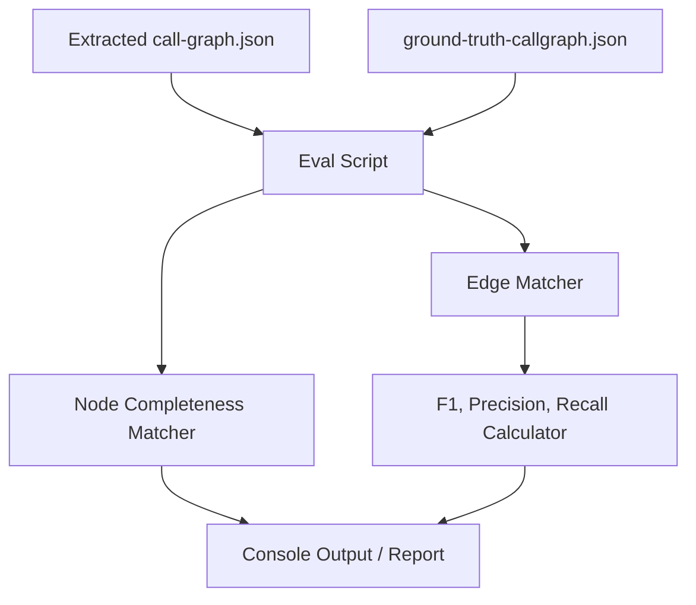

# Call Graph Evaluation Plan

## 1. Objective
Implement Pillar 3 of the Cartographer Evaluation Strategy: Call Graph Accuracy. The goal is to create an automated evaluation framework to measure if the extracted call graph (nodes and edges) matches the actual call relationships in the original source, particularly focusing on the `webpack-hello-world` fixture.

## 2. Prerequisites
- The `extractor-service` must be capable of generating a `call-graph.json` output.
- A foundational `tests/eval/` directory must be established (borrowed from Chunk 1 of the `eval.md` plan).

## 3. Scope & Boundaries
### In Scope
- Creating the `tests/eval/` directory structure.
- Creating a `ground-truth-callgraph.json` manifest for the `webpack-hello-world` fixture.
- Evaluating Call Graph Node Completeness (are all expected functions identified?).
- Evaluating Call Graph Edge Accuracy (precision, recall, F1 score).
- Evaluating Cross-File Edge Accuracy.
- Creating an `npm run eval:callgraph` script.

### Out of Scope
- Evaluating code parse-ability or behavioral equivalence (Pillar 1).
- Evaluating semantic quality of renamed variables/functions (Pillar 2).
- Adding new fixtures beyond `webpack-hello-world`.

## 4. Architecture & Design
### Component Diagram

### Key Design Decisions
- **Fuzzy Matching by Structure**: Since Cartographer renames variables and functions (and these names are non-deterministic or may be inaccurate), nodes and edges will be matched by **structural position** (e.g., file path, line numbers, scope depth) rather than by the generated names.
- **Fixture-Driven**: The evaluation is strictly tied to the `webpack-hello-world` fixture, which acts as a controlled ground truth.

## 5. Implementation Steps
- [x] **Phase 1: Ground Truth Preparation**
  - [x] Create `tests/eval/` directory.
  - [x] Manually encode the expected call relationships (from `app.js`, `tasks.js`, `filters.js`, `storage.js`) into a `tests/eval/ground-truth-callgraph.json` manifest.
- [x] **Phase 2: Node Completeness Eval (Pillar 3.2)**
  - [x] Create an evaluation script that loads both the generated call graph and the ground truth.
  - [x] Write logic to verify every expected function from the ground truth is represented as a node in the generated graph.
- [x] **Phase 3: Edge Accuracy Eval (Pillar 3.1 & 3.3)**
  - [x] Write logic to match generated edges against expected edges.
  - [x] Calculate overall Precision, Recall, and F1 Score for all edges.
  - [x] Calculate specific Precision/Recall for cross-file edges (e.g., `app.js -> filters.js`).
- [x] **Phase 4: Integration**
  - [x] Add `"eval:callgraph"` script to `package.json`.
  - [x] Output a formatted summary of the metrics to the console.

## 6. File Manifest
- **Added:**
  - `tests/eval/ground-truth-callgraph.json`
  - `tests/eval/evaluate-callgraph.ts` (or similar script)
- **Modified:**
  - `package.json` (adding `eval:callgraph` script)

## 7. Testing Requirements
### Existing Tests
- Ensure `tests/run-humanify-e2e.js` still passes as it generates the base output used for these evals.
### New Tests
- The evaluation script itself serves as a test suite for the extractor's accuracy.
### Eval Gate
- **Call graph F1 (overall):** ≥ 0.80
- **Call graph node recall:** 100%
- **Cross-file edge recall:** ≥ 0.80

## 8. Observability & Telemetry
- The script should output a clear CLI table or formatted text block containing:
  - Total Nodes Expected vs Found
  - Total Edges Expected vs Found
  - Precision, Recall, F1 for Edges
  - Cross-File Edge Recall

## 9. Rollback Plan
- Since this track exclusively introduces testing and evaluation infrastructure, rollback consists of reverting the commits containing the `tests/eval/` additions and removing the script from `package.json`. No production code is modified.

## 10. Definition of Done
- `ground-truth-callgraph.json` accurately reflects `webpack-hello-world`.
- `npm run eval:callgraph` successfully executes.
- The script reports Node Completeness, Edge F1 Score, and Cross-File Edge Recall based on structural matching.
- Metrics meet or exceed the designated thresholds (or correctly identify failures if the extractor is lacking).

## 11. Security Considerations
- Execution of evaluated code: This script analyzes JSON artifacts; it does not execute the generated/humanified JavaScript itself, so there is no risk of arbitrary code execution.

## 12. References
- `conductor/tracks/eval.md` (Source Strategy)
- `fixtures/webpack-hello-world/src/*` (Ground truth source)
