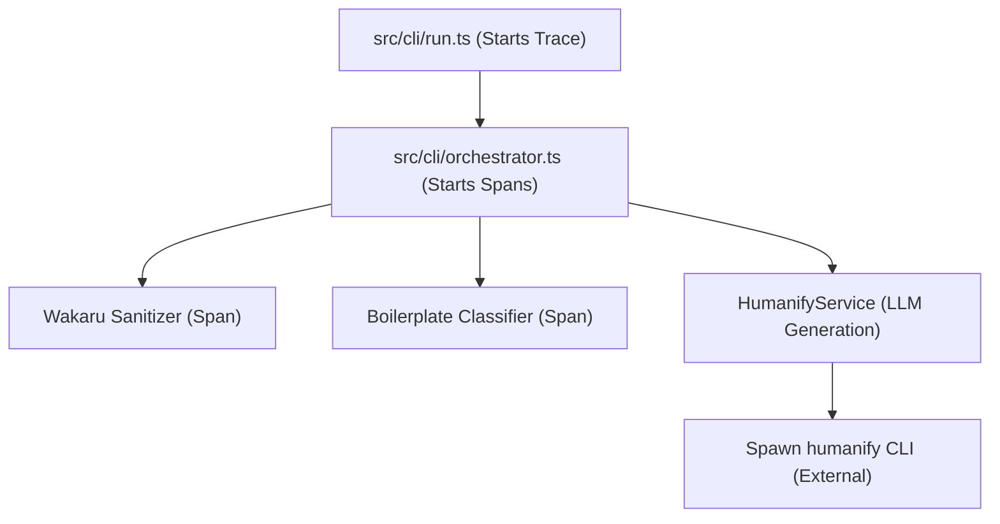

# Implementation Plan: Observability with Langfuse

This document provides a structured plan for instrumenting **JS Cartographer** for AI observability and tracing using the **Langfuse** platform.

---

## 1. Executive Summary

The objective is to integrate Langfuse tracing into JS Cartographer to monitor deobfuscation runs, measure latency, track model execution costs, and debug pipeline failures. 

By instrumenting the map-reduce deobfuscation pipeline, developers and operators will get visibility into:
1. **Pipeline Runs:** High-level execution metrics (file count, options chosen, overall runtime).
2. **Pipeline Stages:** Micro-benchmarks for sanitization, AST classification, boilerplate extraction, and global graph reduction.
3. **LLM Generations:** Detailed logging of prompt inputs, deobfuscated outputs, specific models used, and token count estimations.

---

## 2. Observability Architecture

Currently, JS Cartographer is instrumented using a custom wrapper around `raindrop-ai` (defined in [tracer.ts](file:///home/guid/projects/cartographer/cartographer/src/observability/tracer.ts)). Spans are created and propagated manually using an `interaction` context passed from the CLI down to the pipeline stages.

We propose a **Unified Observability Provider** design that abstracts both Raindrop and Langfuse, enabling either or both via environment variables.

### Programmatic Context Propagation Flow


> [!IMPORTANT]
> Since the live deobfuscation is performed by spawning the external `humanify` binary, the LLM calls are not directly accessible in our Node.js runtime. We must wrap the child process execution block in `HumanifyService` to log a manual **`generation`** observation to Langfuse, capturing stdin as `input` and stdout as `output`.

---

## 3. Langfuse SDK: Direct SDK vs. OpenTelemetry

Langfuse v4/v5 supports both an **OpenTelemetry-native** SDK and the **Direct JS SDK**.

| Criteria | Direct SDK (`langfuse`) | OpenTelemetry (`@langfuse/otel` + `@opentelemetry/sdk-node`) |
|---|---|---|
| **Integration Style** | Manual programmatic calls using client objects (`trace.span()`, `trace.generation()`). | Global bootstrapping via `NodeSDK` and `startActiveObservation()` hooks. |
| **Complexity** | Low. Fits the existing `interaction` object passing pattern exactly. | Moderate/High. Requires global hook interception and asynchronous context propagation. |
| **Generations** | Native support via `trace.generation()`. | Implicitly inferred via OTel span attributes. |
| **Recommendation** | **Recommended (Direct SDK)**: Highly customizable, zero side-effects on the CLI process environment, and maps 1-to-1 to the existing Raindrop setup. | **Alternate**: Use if JS Cartographer is deployed as an online service with global auto-instrumentation needs. |

---

## 4. Step-by-Step Implementation Plan

### Step 4.1: Add Dependencies
Install the official Langfuse Node SDK:
```bash
npm install langfuse
```

### Step 4.2: Configuration & Environment Variables
Add Langfuse configurations to `.env` and `.env.example`:
```env
# Langfuse Observability
LANGFUSE_ENABLED=true
LANGFUSE_PUBLIC_KEY=pk-lf-...
LANGFUSE_SECRET_KEY=sk-lf-...
LANGFUSE_BASE_URL=https://cloud.langfuse.com
```

### Step 4.3: Implement the Unified Tracer
Modify [src/observability/tracer.ts](file:///home/guid/projects/cartographer/cartographer/src/observability/tracer.ts) to define a unified `TracerService` class and `InteractionContext` supporting lazy initialization, metadata validation, and proper context nesting via `AsyncLocalStorage`:

```typescript
import { Raindrop } from 'raindrop-ai';
import { Langfuse } from 'langfuse';
import { AsyncLocalStorage } from 'node:async_hooks';

// Helper function to sanitize and truncate metadata values for Langfuse (strings <=200 chars)
function sanitizeMetadata(metadata: any): Record<string, string> {
  const result: Record<string, string> = {};
  if (!metadata || typeof metadata !== 'object') return result;

  for (const [key, value] of Object.entries(metadata)) {
    if (value === undefined || value === null) continue;
    let strVal = typeof value === 'object' ? JSON.stringify(value) : String(value);
    if (strVal.length > 200) {
      strVal = strVal.substring(0, 197) + '...';
    }
    result[key] = strVal;
  }
  return result;
}

export class InteractionContext {
  private activeSpanStorage = new AsyncLocalStorage<any>();

  constructor(private raindropSpan: any, private langfuseSpan: any) {}

  private getActiveSpan() {
    return this.activeSpanStorage.getStore() || this.langfuseSpan;
  }

  // Wrap a block in a span with proper parent-child nesting
  async withSpan<T>(
    spanConfig: { name: string; properties?: any; inputParameters?: any[] }, 
    fn: () => Promise<T>
  ): Promise<T> {
    const parent = this.getActiveSpan();
    const childLangfuse = parent?.span({
      name: spanConfig.name,
      metadata: sanitizeMetadata(spanConfig.properties),
    });

    // Fallback to Raindrop span logic...
    return this.activeSpanStorage.run(childLangfuse, async () => {
      try {
        const result = await fn();
        childLangfuse?.end({ output: typeof result === 'string' ? result.substring(0, 1000) : result });
        return result;
      } catch (err: any) {
        childLangfuse?.end({ level: 'ERROR', statusMessage: err.message });
        throw err;
      }
    });
  }

  // Log live LLM generation calls as generations (with correct input/output token keys)
  startGeneration(config: { name: string; model: string; input: string }) {
    const parent = this.getActiveSpan();
    const raindropSpan = this.raindropSpan?.startToolSpan({
      name: config.name,
      properties: { model: config.model },
    });

    const langfuseGen = parent?.generation({
      name: config.name,
      model: config.model,
      input: config.input,
    });

    return {
      setOutput: (output: string) => {
        raindropSpan?.setOutput({ size: output.length });
        langfuseGen?.update({
          output,
          usage: {
            // Langfuse JS/TS SDK expects manual token usage as input/output/total (not promptTokens/completionTokens)
            input: Math.ceil(config.input.length / 4),
            output: Math.ceil(output.length / 4),
          }
        });
      },
      setError: (err: Error) => {
        raindropSpan?.setError(err);
        langfuseGen?.update({
          level: 'ERROR',
          statusMessage: err.message,
        });
      },
      end: () => {
        raindropSpan?.end();
        langfuseGen?.end();
      }
    };
  }
}

class TracerService {
  private raindrop?: Raindrop;
  private langfuse?: Langfuse;
  private initialized = false;

  // Lazily initialize SDKs to avoid race conditions with dotenv config loads
  private ensureInitialized() {
    if (this.initialized) return;
    this.initialized = true;

    if (process.env.RAINDROP_WRITE_KEY && process.env.RAINDROP_DISABLED !== 'true') {
      this.raindrop = new Raindrop({
        writeKey: process.env.RAINDROP_WRITE_KEY,
        localWorkshopUrl: process.env.RAINDROP_WORKSHOP_URL,
        disableBatching: true,
      });
    }
    if (process.env.LANGFUSE_ENABLED === 'true' && process.env.LANGFUSE_SECRET_KEY) {
      this.langfuse = new Langfuse({
        publicKey: process.env.LANGFUSE_PUBLIC_KEY,
        secretKey: process.env.LANGFUSE_SECRET_KEY,
        baseUrl: process.env.LANGFUSE_BASE_URL,
      });
    }
  }

  // Create a root trace supporting backwards-compatible parameters
  begin(params: {
    eventId?: string;
    event: string;
    userId: string;
    input?: string;
    model?: string;
    properties?: Record<string, string>;
  }) {
    this.ensureInitialized();

    const raindropTrace = this.raindrop?.begin({
      eventId: params.eventId,
      event: params.event,
      userId: params.userId,
      input: params.input,
      model: params.model,
      properties: params.properties,
    });

    const langfuseTrace = this.langfuse?.trace({
      id: params.eventId,
      name: params.event,
      userId: params.userId,
      input: params.input,
      metadata: sanitizeMetadata({
        ...params.properties,
        model: params.model,
      }),
    });

    return new InteractionContext(raindropTrace, langfuseTrace);
  }

  async shutdown() {
    await this.raindrop?.close();
    await this.langfuse?.shutdown();
  }
}

export const tracer = new TracerService();
```

### Step 4.4: Instrument Humanify CLI Execution
Modify `HumanifyService` in [humanify-service.ts](file:///home/guid/projects/cartographer/cartographer/src/services/llm/humanify-service.ts):
```typescript
// Replace the startToolSpan usage with the new startGeneration API:
const generationSpan = interaction?.startGeneration({
  name: 'llm_rename',
  model: model ?? 'default',
  input: code,
});

// Update outputs and finish inside process callbacks:
child.on('close', (exitCode) => {
  cleanup();
  if (exitCode !== 0) {
    const err = new Error(`Process exited with code ${exitCode}.`);
    generationSpan?.setError(err);
    generationSpan?.end();
    resolve(code);
    return;
  }
  generationSpan?.setOutput(stdoutData);
  generationSpan?.end();
  resolve(stdoutData);
});
```

### Step 4.5: Ensure Graceful SDK Flushes on CLI Exit
In [run.ts](file:///home/guid/projects/cartographer/cartographer/src/cli/run.ts), make sure `tracer.shutdown()` is called in `finally` blocks before exiting the process:
```typescript
try {
  // execute pipeline
} finally {
  await tracer.shutdown();
}
```

---

## 5. Verification, Validation, and Testing

To ensure traces are correctly structured and successfully ingested by Langfuse Cloud without relying solely on manual UI checks, the implementing agent **MUST** follow this verification protocol using `npx langfuse-cli`.

> [!WARNING]
> By default, the `langfuse api traces list` and `langfuse api observations list` commands only return the `core` and `basic` field groups. 
> To inspect input/output text, token usage, and custom metadata, you **MUST** explicitly specify the `--fields` option (e.g., `--fields "core,basic,io,usage,model,metadata"`).

### Step 5.1: Configure Verification Environment
Prior to testing, set up the required environment variables pointing to the target Langfuse project:
```bash
export LANGFUSE_PUBLIC_KEY="pk-lf-..."
export LANGFUSE_SECRET_KEY="sk-lf-..."
export LANGFUSE_BASE_URL="https://cloud.langfuse.com"
export LANGFUSE_HOST="$LANGFUSE_BASE_URL" # The CLI commands use LANGFUSE_HOST for API calls
```

Validate connection credentials using the CLI schema discovery tool:
```bash
npx langfuse-cli api __schema
```
*Verification condition: The command must exit with code `0` and return the JSON schema.*

### Step 5.2: Execute End-to-End Test Run

Run the deobfuscation CLI pipeline on the test fixtures:
```bash
LANGFUSE_ENABLED=true node dist/cli/run.js fixtures/simple-project --output test-output-project
```

#### Step 5.3: Automated Trace Validation via CLI

Write the automated trace validation script to `scripts/verify-observability.js`:

```javascript
import { execSync } from 'node:child_process';

function runCliCommand(command) {
  try {
    const output = execSync(command, { encoding: 'utf-8', env: process.env });
    return JSON.parse(output);
  } catch (err) {
    console.error(`Failed executing: ${command}`, err.stderr || err.message);
    process.exit(1);
  }
}

console.log('Fetching recent traces from Langfuse...');
// Ensure we fetch metadata/io fields
const tracesResponse = runCliCommand('npx langfuse-cli api traces list --limit 5 --fields "core,io" --json');
const traces = tracesResponse.data || tracesResponse;

const cartographerTrace = traces.find(t => t.name === 'cartographer_run');
if (!cartographerTrace) {
  console.error('❌ Fail: Could not find any trace with name "cartographer_run" in the last 5 traces.');
  process.exit(1);
}

const traceId = cartographerTrace.id;
console.log(`✅ Success: Found trace "cartographer_run" with ID: ${traceId}`);

console.log(`Fetching observations for trace: ${traceId}...`);
// Query all field groups to fully inspect the telemetry details
const obsResponse = runCliCommand(`npx langfuse-cli api observations list --trace-id "${traceId}" --fields "core,basic,io,usage,model,metadata" --json`);
const observations = obsResponse.data || obsResponse;

console.log(`Analyzing ${observations.length} observations...`);

// 1. Verify Spans Existence
const expectedSpans = ['sanitize', 'boilerplate_classify', 'app_code_extract', 'ast_extract', 'write_output'];
for (const spanName of expectedSpans) {
  const span = observations.find(o => o.name === spanName);
  if (!span) {
    console.error(`❌ Fail: Missing expected span: "${spanName}"`);
    process.exit(1);
  }
  console.log(`  - Found span: "${spanName}"`);
}

// 2. Verify Hierarchical Nesting (Parent-Child relationships)
const processFileSpan = observations.find(o => o.name === 'process_file');
if (!processFileSpan) {
  console.error('❌ Fail: Root file processing span "process_file" not found.');
  process.exit(1);
}

const nestedSpans = ['sanitize', 'boilerplate_classify', 'app_code_extract', 'llm_rename'];
for (const spanName of nestedSpans) {
  const child = observations.find(o => o.name === spanName);
  if (child && child.parentObservationId !== processFileSpan.id) {
    console.error(`❌ Fail: Nesting violation! "${spanName}" (parent: ${child.parentObservationId}) is not nested under "process_file" (${processFileSpan.id})`);
    process.exit(1);
  }
}
console.log('✅ Success: Nested span hierarchy is correctly resolved (AsyncLocalStorage verified).');

// 3. Verify LLM Generation parameters and token usage
const generation = observations.find(o => o.name === 'llm_rename');
if (!generation) {
  console.error('❌ Fail: LLM Generation named "llm_rename" not found.');
  process.exit(1);
}

if (generation.type !== 'GENERATION') {
  console.error(`❌ Fail: "llm_rename" is not marked as GENERATION type. Found: ${generation.type}`);
  process.exit(1);
}

console.log('Validating Generation schema...');
console.log(`  - Model:  "${generation.providedModelName || generation.model}"`);
console.log(`  - Tokens: Input=${generation.inputTokens || generation.usageDetails?.input}, Output=${generation.outputTokens || generation.usageDetails?.output}`);

if (!generation.input || generation.input.trim() === '') {
  console.error('❌ Fail: Generation prompt input is empty.');
  process.exit(1);
}

if (!generation.output || generation.output.trim() === '') {
  console.error('❌ Fail: Generation response output is empty.');
  process.exit(1);
}

const inputTokens = generation.inputTokens || generation.usageDetails?.input;
const outputTokens = generation.outputTokens || generation.usageDetails?.output;
if (!inputTokens || !outputTokens || inputTokens <= 0 || outputTokens <= 0) {
  console.error('❌ Fail: Invalid token usage numbers in Generation.');
  process.exit(1);
}

console.log('✅ Success: Observability verification passed successfully!');
process.exit(0);
```

#### How to Run the Verification Script

1. **Verify Environment Variables:** Make sure your shell contains active credentials to access the target Langfuse Cloud project:
   ```bash
   export LANGFUSE_PUBLIC_KEY="pk-lf-..."
   export LANGFUSE_SECRET_KEY="sk-lf-..."
   export LANGFUSE_BASE_URL="https://cloud.langfuse.com"
   export LANGFUSE_HOST="$LANGFUSE_BASE_URL"
   ```
2. **Execute the Verification Script:**
   ```bash
   node scripts/verify-observability.js
   ```
3. **Analyze Results:**
   * **Exit Code `0`:** If the script prints `✅ Success: Observability verification passed successfully!` and exits with `0`, it validates that the traces arrived correctly in the format and schema expected by Langfuse.
   * **Exit Code `1` (or non-zero):** The script failed to find the trace, found nested spans that were flat (or not properly structured under `process_file`), or encountered invalid generation telemetry/tokens. Look for the output starting with `❌ Fail:` to pinpoint the issue.

### Step 5.4: Unit & Integration Tests (Mock Verification)
To guard against regression, write offline Vitest spy tests under the `tests/` directory:
- Use `vi.spyOn(Langfuse.prototype, 'trace')` to verify that starting a run initiates a trace.
- Use `vi.spyOn(InteractionContext.prototype, 'withSpan')` to verify execution blocks are wrapped correctly.
- Use `vi.spyOn(InteractionContext.prototype, 'startGeneration')` to verify generation and usage data are passed.
