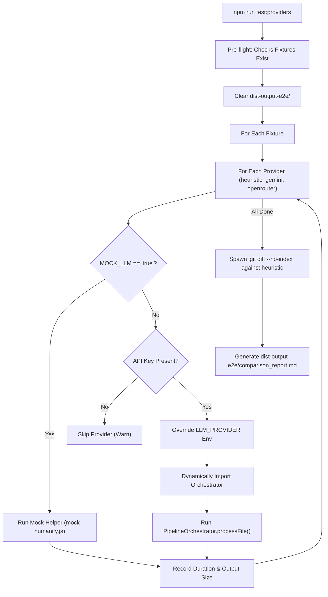

# JS Cartographer E2E Multi-Provider Comparison Deep Dive

This document provides a detailed technical breakdown of the **E2E Multi-Provider Comparison** feature implemented in this branch.

---

## 1. Feature Architecture Overview

The multi-provider E2E comparison feature is designed to evaluate, benchmark, and compare the code deobfuscation outputs of different execution backends:
1. **`heuristic`**: AST-based static code renaming/normalization.
2. **`gemini`**: Live deobfuscation and renaming using the Google Gemini API.
3. **`openrouter`**: Live deobfuscation and renaming via the OpenRouter API.

It processes a designated set of bundle files (fixtures), saves their outputs in isolated, provider-specific subdirectories, evaluates performance (timing and output size), generates side-by-side output comparison snippets, runs `git diff` comparisons, and packages all results into a unified markdown report.



---

## 2. Key Components

### 1. Test Script: [run-provider-comparison.js](file:///home/guid/projects/cartographer/cartographer/tests/run-provider-comparison.js)
This is the master entrypoint script, which executes the benchmark flow:
* **Dynamic Environment Switching:** It iterates through the providers, overrides `process.env.LLM_PROVIDER`, imports the `PipelineOrchestrator` dynamically inside the loop to register the updated environment variable, and restores the original provider in a `finally` block.
* **Isolated Output:** Output is saved at `dist-output-e2e/<provider>/<fixture_name>`.
* **API Key Safety:** Skips providers gracefully if `process.env.MOCK_LLM !== 'true'` and the corresponding environment key (`GEMINI_API_KEY` or `OPENROUTER_API_KEY`) is missing.
* **Metric Collection:** Tracks the time taken, the file size, and the LLM model name.

### 2. Mock Helper: [mock-humanify.js](file:///home/guid/projects/cartographer/cartographer/tests/helpers/mock-humanify.js)
To avoid API charges and rate limits during routine testing or offline development:
* If `MOCK_LLM=true` is set in the environment, LLM providers (`gemini` and `openrouter`) bypass network calls entirely.
* The mock helper performs a regex replacement mapping obfuscated identifiers (like `_0x1a2b`) to `mock_<provider>_1a2b`. This verifies the pipeline's file writing and report building workflow.

### 3. Unified Git Diffing:
Instead of bringing in heavy library dependencies, the system uses Node's `child_process.spawnSync` to invoke:
```bash
git diff --no-index --unified=3 dist-output-e2e/heuristic/<fixture> dist-output-e2e/<provider>/<fixture>
```
This leverages the native Git engine to produce standard, human-readable diffs highlighting variable names and structure changes.

---

## 3. How to Run & Use the Feature

The system supports both offline mock validation and live API execution.

### Option A: Mock Mode (No APIs, Offline-Friendly)
Perfect for validating the deobfuscation test pipeline, layout formatting, or linting.
```bash
MOCK_LLM=true npm run test:providers
```
**Expected Console Output:**
```
🚀 Starting Multi-Provider E2E comparison test...
[E2E] Processing fixture: bundle.js
--- Provider: heuristic ---
[E2E] Running Orchestrator for heuristic...
✅ [E2E] Success: 1.09s, Size: 19074
--- Provider: gemini ---
[E2E] Running mock process for gemini...
✅ [E2E] Success: 0.00s, Size: 9450
--- Provider: openrouter ---
[E2E] Running mock process for openrouter...
✅ [E2E] Success: 0.00s, Size: 9450
[E2E] Generating diffs against heuristic baseline...
[E2E] Generating comparison_report.md...
🎉 [E2E] Report successfully generated at dist-output-e2e/comparison_report.md
```

### Option B: Real Live Run
Benchmarks actual LLM models. Note that this requires valid API keys in your `.env` file.
```bash
npm run test:providers
```
If a key is missing (e.g. `OPENROUTER_API_KEY`), the runner outputs a warning and skips that provider:
```
⚠️ Skipping openrouter: No API key found
```

---

## 4. Reading the Report

All outputs and metrics are outputted to `dist-output-e2e/`. The master file is [comparison_report.md](file:///home/guid/projects/cartographer/cartographer/dist-output-e2e/comparison_report.md).

The report contains three core sections:
1. **Execution Summary:** An execution matrix showing whether each provider succeeded, failed, or was skipped, as well as elapsed duration, resulting byte sizes, and models.
2. **Output Snippets (First 30 Lines):** Displays the head of the deobfuscated JavaScript side-by-side (sequentially) to quickly compare coding conventions and naming quality.
3. **Diffs (vs heuristic baseline):** Unified git diffs showing exactly how names were rewritten relative to the static heuristic parser baseline.

---

## 5. Design Verification & Specifications
* **Conductor Track Index:** [index.md](file:///home/guid/projects/cartographer/cartographer/conductor/tracks/e2e_provider_comparison/index.md)
* **Conductor Test Plan:** [e2e_test_plan.md](file:///home/guid/projects/cartographer/cartographer/conductor/tracks/e2e_provider_comparison/e2e_test_plan.md)
* **Conductor Execution Plan:** [plan.md](file:///home/guid/projects/cartographer/cartographer/conductor/tracks/e2e_provider_comparison/plan.md)
