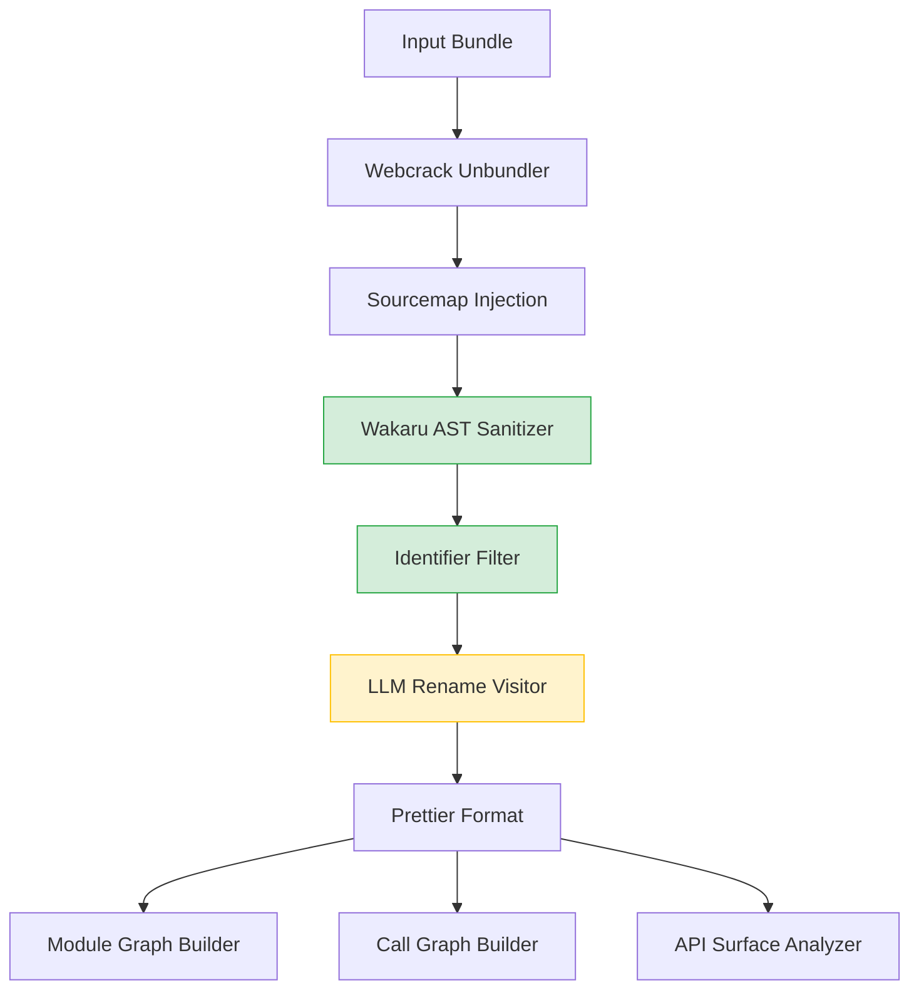

# JS Cartographer (cartographerjs): Comprehensive Project Retrospective

This document presents a retrospective review of the design, architectural progression, and development process of the JS Cartographer project. It evaluates the project's intent and objective against its current state, analyzes the git commit history and design milestones, and proposes three concrete ways the development and engineering process could have been executed better.

---

## 1. Intent, Objective, and Current State

### Intent and Objective
The core intent of JS Cartographer is to reverse JavaScript minification and obfuscation. Traditional tools beautify code but leave variables named `a`, `b`, or `_0x12a`. Large Language Models (LLMs) excel at naming variables based on context but struggle with the compiler-restructured syntax of transpiled code (such as state-machine generator functions representing `async/await`, prototype chains representing ES6 classes, or transpiled JSX elements). 

JS Cartographer was conceived to solve this by decoupling structural restoration (using AST-based deterministic tools like Wakaru and Webcrack) from semantic naming (using LLMs with JSON schemas or constrained GBNF grammars). On top of deobfuscation, the objective expanded to map the codebase into navigable dependency graphs, call graphs, and reconstructed API surfaces, making obfuscated bundles fully understandable.

### Current State
The project is feature-complete and robust:
- **Pipeline:** Runs sequential passes of Webcrack $\rightarrow$ Sourcemap Injection $\rightarrow$ Wakaru AST Sanitization $\rightarrow$ Heuristic/Filter $\rightarrow$ LLM renaming $\rightarrow$ Prettier $\rightarrow$ Dependency and Call Graph extraction.
- **Resilience:** Integrates key rotation (`KeyManager`) for rate-limit resilience and file caching (`StateCache`) to support resuming interrupted runs.
- **Local Execution:** Supports local model downloads and execution with quantized GGUF models via `node-llama-cpp` and GBNF grammars.
- **Web Explorer:** Hosts an interactive local Express server serving a React Flow and Monaco Editor Single Page Application (SPA), allowing visual code navigation.

---

## 2. Git History & Evolution Review

Analyzing the git history reveals a progression focused on stability, optimization, and scale:

1. **Syntax Cleanup Layer (Phases 1-2):** Wired dynamic loading of `@wakaru/unminify` via Node's `createRequire` to bypass ESM packaging incompatibilities. Transpiled generator patterns and ES6 classes were restored before prompt generation, simplifying the LLM's workload.
2. **Cost Optimization & Filtering (Phase 3 & Identifier Filter):** Introduced the `identifier-filter.ts` pre-pass to skip well-known globals and descriptive names. This reduced tokens by 40–60% and prevented the LLM from trying to rename static references like `window` or `document`.
3. **Directory Processing & Scalability (Batch Processing):** Transitioned from a single-file pipeline to automated directory scan and chunk discovery (`DiscoveryService`), handling multi-file output tasks in subdirectories to prevent bundle name collisions.
4. **Resiliency and Key Management (Rate Limits & State Cache):** Introduced `StateCache` to skip already-processed modules and `KeyManager` to rotate active API keys, allowing large bundle analyses to survive rate limits.
5. **Interactive UI & Local Modeling (Web Explorer & Qwen3-Coder):** Added the React Flow Web Explorer and upgraded `node-llama-cpp` to support local Gwen3-Coder-30B GGUF models.
6. **Syntax/Pipeline Fixes (Latest Commits):** Cleaned up file discovery, added `sourceType: "unambiguous"`, and expanded Babel parser plugins to ensure parsing does not fail on modern ES6+/TypeScript constructs.

---

## 3. Key Design Decisions: Impact & Alternatives



### 3.1. Separating Wakaru AST Rewrites from LLM Renaming
- **Impact:** Extremely positive. Cleaning sequence expressions, Yoda conditions, and template strings made code highly readable for the LLM. It avoided feeding "noisy" decompiled compiler artifacts into the prompt, resulting in cleaner naming suggestions and a lower token count.
- **Alternative:** Running LLMs directly on raw minified code, instructing the model to "beautify and rename." This would have been expensive, prone to syntax hallucinations, and structurally unstable.

### 3.2. Scope-based Scope Size Sorting (`visitAllIdentifiers.ts`)
- **Impact:** In `findScopes()`, identifiers are sorted by enclosing block size in descending order. This causes outer/global scopes to be named before inner scopes, ensuring that major components (e.g. entry functions or class definitions) are named first and act as naming context for nested parameters.
- **Alternative:** Sorting ascending (naming local loop variables first) or random traversal. Random traversal would cause the LLM to rename inner variables without knowing the named context of the parent function, lowering naming accuracy.

### 3.3. Key Rotation & Caching Services (`KeyManager` & `StateCache`)
- **Impact:** Added during scalability iterations, these allowed the project to scale to multi-megabyte bundles. The pipeline became resume-safe, saving time and credit costs when runs failed mid-process.
- **Alternative:** Retrying the entire batch from scratch. For large bundles with hundreds of files, this was highly inefficient.

---

## 4. Three Ways the Development Process Could Have Been Executed Better

While the current architecture is stable and fully functional, reviewing the progression and git history highlights three key areas where the architectural design and development process could have been executed better.

### Way 1: Lack of a Unified AST Parser & Traversal Service
* **The Problem:** The codebase contains multiple files that parse and traverse JavaScript files independently: `visitAllIdentifiers.ts`, `framework-detector.ts`, `GraphBuilder`, `CallGraphBuilder`, and `ApiAnalyzer`. Because the project's bundler (`pkgroll`) compiles everything to ESM, importing CommonJS packages like `@babel/traverse` and `@babel/core` caused resolution mismatches. To work around this, the exact same interop check:
  ```typescript
  const traverse = (typeof _traverse === 'function' ? _traverse : (_traverse as any).default) as typeof _traverse;
  ```
  was copy-pasted across **five** different modules.
* **The Architectural Cost:** Code duplication and maintenance overhead. If parser plugins need to be updated (e.g., adding experimental decorators support or typescript configuration), changes must be made across all parser instances.
* **How It Could Have Been Done Better:** Create a single, centralized module (e.g., `src/ast-utils.ts` or `src/services/ast/index.ts`) that manages:
  1. Parsing config, including default parser plugins (JSX, TypeScript, decorators-legacy, doExpressions).
  2. ESM/CJS interop hacks in a single place.
  3. Exporting clean `parseCode(code)` and `traverseAst(ast, visitors)` functions.
* **Alignment with Objectives:** Centralizing AST processing increases code maintainability and ensures that all static analysis modules support the exact same syntax specs.

### Way 2: Redundant File Read & Parse Cycles (Redundant Disk I/O & CPU overhead)
* **The Problem:** The pipeline runs multiple distinct analysis stages sequentially. For every single unbundled file, the orchestrator:
  1. Reads the file, parses it to an AST, runs Wakaru transformation rules, formats it via Prettier, and writes it back to disk.
  2. Reads the file again, parses it to an AST, runs `visitAllIdentifiers` (which traverses and calls the LLM for renaming), and writes it back to disk.
  3. Reads the file a third time, parses it, and traverses it in `GraphBuilder` to build the dependency map.
  4. Reads the file a fourth time, parses it, and traverses it in `CallGraphBuilder` to build the call graph.
  5. Reads the file a fifth time, parses it, and traverses it in `ApiAnalyzer` to look for fetch/axios sinks.
* **The Architectural Cost:** Disk thrashing and CPU performance bottlenecks. Parsing text into a Babel AST and traversing it is highly CPU-intensive. Re-parsing the same code files five times in sequence creates massive overhead, particularly on larger projects with hundreds of modules.
* **How It Could Have Been Done Better:** Re-architect the pipeline around a shared **InMemory AST Context** or a unified **Single-pass Static Analysis Engine**:
  - Store the active AST in memory during the pipeline run instead of continuously writing to and reading from disk.
  - Combine the post-deobfuscation analysis tools. A single AST traversal pass could collect dependency imports/exports, function call nodes, and API sinks simultaneously using a unified Babel visitor, rather than running three separate parse-and-traverse passes in `GraphBuilder`, `CallGraphBuilder`, and `ApiAnalyzer`.
* **Alignment with Objectives:** By reducing disk I/O and Babel parse cycles, batch processing of large bundles would run significantly faster and use less system memory.

### Way 3: Naive Path Resolution and Lack of Module Mapping
* **The Problem:** In `CallGraphBuilder.resolvePath()`, paths are resolved using a naive jointer:
  ```typescript
  private resolvePath(currentFile: string, importPath: string): string {
    const dir = path.dirname(currentFile);
    let resolved = path.join(dir, importPath);
    if (!resolved.endsWith(".js")) resolved += ".js";
    return resolved;
  }
  ```
  `GraphBuilder` does not resolve paths at all, simply saving the raw string of the import (e.g. `require('./auth')` $\rightarrow$ `imports.push('./auth')`).
* **The Architectural Cost:** Graph disconnection. Obfuscated bundles decompiled by Webcrack contain extensionless imports, folder imports (resolving to `index.js`), webpack aliases, or subpath exports in `node_modules`. Using `path.join(dir, importPath) + ".js"` will fail on directory imports or alias configurations, resulting in disconnected module nodes and missing call graph edges in complex codebases.
* **How It Could Have Been Done Better:** Integrate a robust module resolver like `enhanced-resolve` (the library used by Webpack) or use Node's internal `module.createRequire` resolver mapping. This would resolve every import to its canonical absolute file path before writing to `module-graph.json` or mapping call edges in `call-graph.json`.
* **Alignment with Objectives:** Ensuring imports resolve to actual file nodes makes the generated graphs and the Web Explorer significantly more accurate, preventing broken navigation links.

---

## 5. Conclusion

JS Cartographer is an outstanding engineering solution that successfully combines static de-transpilation with LLM intelligence. However, its evolutionary progression resulted in minor architectural debt: copy-pasted ESM/CJS workarounds, redundant AST parsing cycles, and naive path resolution. Implementing a centralized AST utility, a single-pass analysis visitor, and a formal module resolver would make the system faster, more maintainable, and highly robust for larger bundles.
